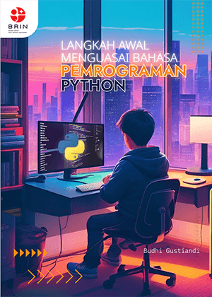

# Belajar Python
Proyek hasil latihan dari buku **Langkah Awal Menguasai Bahasa Pemrograman Python** oleh Budhi Gustiandi - Jakarta: Penerbit BRIN, 2023

## Proyek 1
* ([file](/projects/01-bilangan-acak.py)) Bilangan Acak
* (file) Kutipan Acak

## Proyek 2
* (file) Mengubah Teks menjadi Daftar
* (file) Menghitung Frekuensi Kemunculan Kata di Dalam Daftar

## Proyek 3
* (file) Pengulangan While
* (file) Membuat Program Lebih Interaktif
